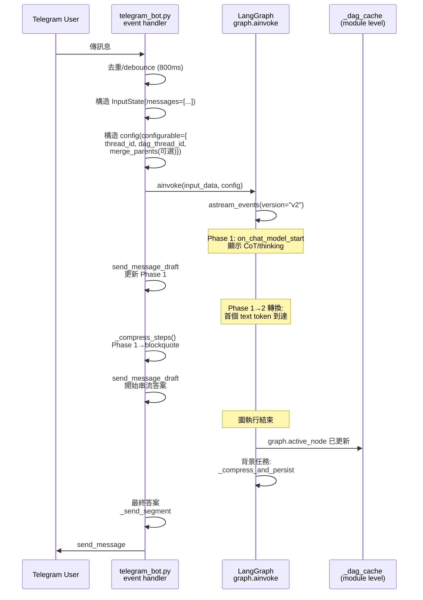
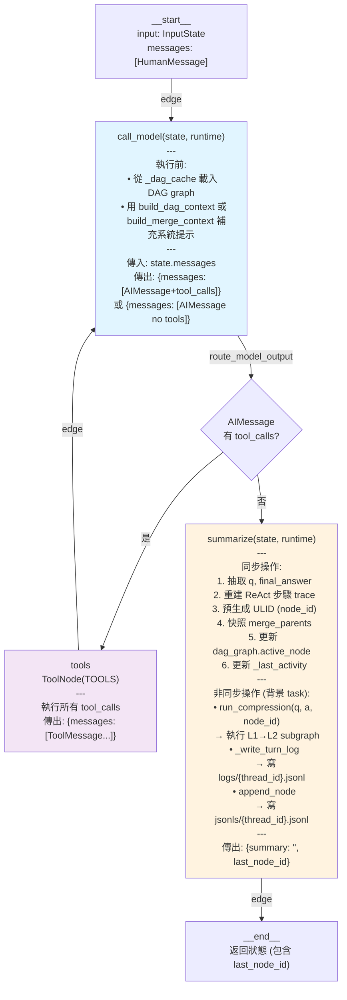

# LangGraph DAG Agent — 完整技術備忘錄

> 本文件是專案的完整技術參照，涵蓋架構、設計決策、資料流與實作細節。閱讀此文檔無需查看原始碼。

---

## 1. 宏觀專案介紹

### 專案定位

一個 **ReAct agent** 系統，核心創新是用 **DAG（有向無環圖）** 而非線性 list 來建模對話歷史。每個 Q-A 回合是一個圖節點，可以分支（從同一點探索多個方向）、合併（多條路匯聚）、軟刪除（tombstone 標記），支援互動式導航與分支切換。

### 技術棧

| 層級 | 技術 | 用途 |
|------|------|------|
| **LLM** | Google Gemini 2.0 Flash / 3.1 Flash Lite | 主推理 + 壓縮 |
| **Agent Framework** | LangGraph 1.0+ | graph 編譯、state 管理、checkpoint |
| **Frontend** | Telegram Bot API (python-telegram-bot 22.6+) | 聊天界面 + 指令 |
| **Memory** | JSONL + DAG Engine | 對話持久化 + DAG 操作 |
| **Compression** | L1/L2 subgraph (lossless_compressor) | 語意壓縮 |

### 三個 Git Repo

```
langgraph-agent-fundamentals (main repo)
├── src/agent/                    # LangGraph agent 邏輯
├── src/jsonl-dag-engine/         # submodule：DAG 引擎 + JSONL I/O
├── src/lossless_compressor/      # submodule：L1→L2 壓縮管線
├── bot/telegram_bot.py           # Telegram 前端（1683 行）
└── pyproject.toml                # editable install 配置
```

三個 repo 的關係：
- **main** → 依賴 jsonl-dag-engine（SSOT 控制）
- **main** → 依賴 lossless_compressor（via agent/compression adapter）
- **jsonl-dag-engine** 獨立演化（DAG 算法）
- **lossless_compressor** 獨立演化（壓縮 prompt）

---

## 2. 交互模式

### 終端使用者視角（Telegram）

#### 2.1 基本對話流
1. 使用者傳訊息
2. Bot 顯示 **Phase 1 draft**：思考過程（CoT）+ tool 呼叫狀態（⏳→✅）
3. 首個文本 token 到達 → **轉換為 Phase 2**
4. Phase 1 內容壓縮成 `<blockquote expandable>`，答案串流
5. 最終答案分段發送（multi-part message handling）

#### 2.2 指令清單

| 指令 | 功能 | 交互模式 |
|------|------|--------|
| `/list [n]` | 列出最後 n 個對話節點 | 列表 + 節點 ID |
| `/branch <prefix>` | 檢視以 prefix 開頭的節點的所有子分支 | 互動式樹狀 |
| `/switch <prefix>` | 切換 active node 到 prefix，壓縮被放棄的分支 | 確認提示 |
| `/status` | 目前 active node 詳情 + 統計 | 文本 |
| `/paths` | 顯示 root → active_node 的所有路徑（含 merge） | 樹狀 |
| `/delete <prefix>` | 軟刪除節點（tombstone 記錄） | 刪除確認 |
| `/render` | 生成 DAG 拓撲圖 (PNG via graphviz) | PNG 送出 |
| `/maintain` | 觸發 JSONL compact/reorder/rebuild_index | 確認 + 完成通知 |
| `/view [prefix]` | 互動式節點瀏覽（前後文、分頁） | Inline buttons |
| `/merge <parent1> <parent2> ...` | 標記下一輪訊息為 merge node | 狀態標記 |

#### 2.3 HITL（Human-in-the-Loop）交互

agent 遇到歧義時呼叫 `ask_user` tool：

```
[agent 發出問題]
❓ Agent 詢問：「是想要 A 還是 B？」
[Inline buttons: A | B | ...]
```

使用者點擊 → 中斷被恢復 → agent 以該答案繼續推理。

---

## 3. 完整程式碼架構與邏輯流

### 3.1 目錄結構

```
langgraph-agent-fundamentals/
├── src/
│   ├── agent/
│   │   ├── graph.py          (398 行) ReAct graph 定義 + 生命週期
│   │   ├── state.py          (60 行)  InputState / State 定義
│   │   ├── tools.py          (48 行)  @register_tool decorator + search / ask_user
│   │   ├── dag.py            (105 行) DAG 引擎 shim + context builder
│   │   ├── context.py        (49 行)  Context dataclass (model, system_prompt)
│   │   ├── llm.py            (71 行)  Model routing (google_genai / ollama)
│   │   ├── prompts.py        (48 行)  System prompt 常數
│   │   ├── utils.py          (31 行)  get_message_text 等 helper
│   │   ├── logging_config.py (61 行)  Structured logging setup
│   │   └── compression/
│   │       ├── graph.py      (20 行)  Adapter：wiring agent.llm → lossless_compressor
│   │       └── __init__.py
│   ├── jsonl-dag-engine/          # submodule
│   │   ├── dag_engine.py          # Node / Graph domain types + public API
│   │   ├── file_handler.py        # JSONL I/O 原語
│   │   ├── prompt_builder.py      # Conversation render
│   │   └── ...
│   └── lossless_compressor/       # submodule
│       └── lossless_compressor/
│           ├── graph.py           # L1→L2 compression subgraph
│           ├── prompts.py         # L1/L2 prompt 常數
│           └── __init__.py
├── bot/
│   ├── telegram_bot.py       (1683 行) Telegram 前端（核心邏輯）
│   └── discord_bot.py        (停用)
├── jsonls/                   # 執行時生成：{thread_id}.jsonl
├── logs/                     # 執行時生成：{thread_id}.jsonl (turn logs)
├── .env                      # API keys + config
├── pyproject.toml            # editable install 配置
├── pyrightconfig.json        # extraPaths 設定
└── CLAUDE.md                 # 開發者指南
```

### 3.2 模組依賴關係

```
telegram_bot.py
  ├─→ agent/graph.py
  │     ├─→ agent/state.py
  │     ├─→ agent/tools.py
  │     ├─→ agent/dag.py (SSOT：DAG cache)
  │     ├─→ agent/context.py
  │     └─→ agent/compression/graph.py
  │           └─→ lossless_compressor (DI: model_factory)
  ├─→ agent/dag.py
  │     └─→ jsonl-dag-engine (Graph/Node 操作)
  └─→ markdown-it-py (Markdown → HTML)
```

**關鍵設計** — `_dag_cache` 是模組層級的 dict，不在 LangGraph State 內。這避免了每次 invoke 的序列化成本。

### 3.3 資料流（一次完整對話）

#### 3.3.1 Telegram ↔ LangGraph 邊界



#### 3.3.2 LangGraph 內部 State 流動



**State 傳遞細節**

| Field | 類型 | 初始值 | 誰修改 | 備註 |
|-------|------|--------|--------|------|
| `messages` | `Sequence[AnyMessage]` | `[]` | `call_model` / `tools` / `summarize` | 使用 `add_messages` annotated，自動合併 |
| `is_last_step` | `IsLastStep` | False | LangGraph managed | 到達 recursion_limit-1 時設為 True |
| `summary` | str | `""` | `summarize` | 目前未使用（空字串） |
| `last_node_id` | str \| None | None | `summarize` | 用於 Telegram 顯示最後節點 ID |

**關鍵變數（模組層級）**

| 變數 | 型別 | 用途 | 生命週期 |
|------|------|------|--------|
| `_dag_cache` | `dict[str, Graph]` | 避免每次 invoke 重新載入 JSONL | Session lifetime |
| `_turn_start` | `dict[str, datetime]` | 記錄 turn 開始時間（用於 duration 計算） | Per-invoke |
| `_last_activity` | `dict[str, datetime]` | Session watchdog 的 idle 追蹤 | Session lifetime |
| `_compression_tasks` | `set[Task]` | 背景壓縮任務的生命週期管理 | Per-invoke，完成時自動移除 |
| `_watchdog_task` | `Task \| None` | Session 閒置 10 分鐘自動 flush | Process lifetime |

**Shutdown 順序（確保資料完整性）**

```
1. cancel_session_flusher()       ← 停止 watchdog
2. drain_compression_tasks(30s)   ← 等背景壓縮完成
3. flush_all_sessions()           ← 持久化所有 DAG + session records
```

若步驟順序錯誤（例如先 flush 再 drain），會導致 append_node 寫入失敗。

---

## 4. 核心設計

### 4.1 DAG 作為對話記憶體

#### 4.1.1 為什麼是 DAG？

線性 chat history（`List[Message]`）只能支援單鏈。DAG 的優勢：

- **分支**：從同一節點發起多個探索方向（多個假設、不同詢問角度）
- **合併**：多條分支匯聚到同一個後繼節點（綜合結論）
- **軟刪除**：節點標記 tombstone，邏輯刪除但保留操作審計
- **查詢**：支援路徑枚舉、祖先查詢、子樹遍歷

#### 4.1.2 Node 與 Graph 資料結構

```python
@dataclass
class Node:
    id: str                    # ULID
    q: str                     # 問題
    a: Optional[str]           # 答案
    sum: Optional[str]         # 壓縮後的摘要
    parents: list[str]         # 父節點 ID 列表（可多個 = merge node）
    created_at: str            # ISO timestamp
    compressed: bool           # 是否是壓縮節點（abandoned branch summary）
    keyword: list[str]         # 壓縮時提取的關鍵詞
    scope: list[str]           # 壓縮的原始節點 ID 集合
    log_ref: int | None        # logs/{thread_id}.jsonl 的行號（1-based）

@dataclass
class Graph:
    meta: dict                 # 圖元資料（版本、schema）
    active_node: Optional[str] # 當前活躍節點（對話指標）
    nodes: dict[str, Node]     # 所有節點（id → Node）
    children: dict[str, list[str]]  # 反向索引（parent_id → [child_ids]）
    session_id: str            # ULID，圖的唯一識別
    started_at: str            # 圖建立時間
    session_records: list[dict]  # 會話結束時的 session records
```

#### 4.1.3 JSONL Append-Only 模式

DAG 被序列化為 JSONL，每行一條 record。`append_node()` 只 append，不覆蓋。

**Record 類型**（完整 schema 見 Section 5）

- `type: "meta"` — 圖元資料
- `type: "node"` — 對話節點
- `type: "tombstone"` — 軟刪除標記
- `type: "session"` — 會話結束記錄
- `type: "topology"` — 圖拓撲索引（由 `maintain()` 寫入）

#### 4.1.4 Maintain 管線

JSONL 日漸增長。`maintain()` 是唯一的 rewrite 操作，執行：

1. **compact** — 移除沒有子節點的 tombstoned 節點
2. **reorder** — 拓撲排序所有 node，保持 meta 首、session 尾
3. **rebuild_index** — 重建 line number 索引（log_ref 映射）
4. **write topology** — 記錄當前圖拓撲（edges / roots / line_index）

使用者呼叫 `/maintain` 或 agent 每月後台觸發。

#### 4.1.5 核心算法

| 操作 | 時間複雜度 | 說明 |
|------|-----------|------|
| `flattened_ancestors(node_id)` | O(V+E) | DFS 收集所有祖先節點（拓撲序） |
| `paths_to_root(node_id)` | O(V·P) | 列舉 root → node 的所有路徑（P = 路徑數） |
| `path_to_root(node_id)` | O(V+E) | 一條路徑（若有 merge 節點，取第一條） |
| `subtree(node_id)` | O(V+E) | BFS 收集子樹 |
| `detect_abandoned_branch(old, new)` | O(V+E) | `/switch` 時找被放棄的分支（用於壓縮） |

### 4.2 Non-Blocking 壓縮與關機排水

#### 4.2.1 同步/非同步邊界

`summarize` node 在 10ms 內完成所有同步操作，然後立即 return。壓縮（LLM call）在背景執行。

```python
async def summarize(state: State, ...) -> dict:
    # === 同步區塊（≈ 10ms）===
    user_query = get_message_text(state.messages[0])
    final_answer = get_message_text(state.messages[-1])
    node_id = generate_id()  # 預生成 ULID
    
    # 快照 merge_parents 並清除（防止下一輪被重複使用）
    merge_parents = getattr(dag_graph, "_merge_parents", None)
    if merge_parents:
        del dag_graph._merge_parents
    
    # ⭐️ 最關鍵：同步更新 active_node
    dag_graph.active_node = node_id
    _last_activity[dag_thread_id] = datetime.now(tz=UTC)
    
    # === 非同步區塊（背景執行）===
    async def _compress_and_persist() -> None:
        sum_text = await run_compression(user_query, final_answer, node_id)
        log_ref = await _write_turn_log(...)
        await asyncio.to_thread(append_node, dag_graph, ..., log_ref=log_ref)
    
    task = asyncio.create_task(_compress_and_persist())
    _register_compression_task(task)
    
    return {"summary": "", "last_node_id": node_id}
```

#### 4.2.2 Pre-Shared ULID

node_id 在 summarize 中預生成，用於：
- DAG node.id
- logs/{thread_id}.jsonl 的 node_id 欄位
- DAG node.log_ref 反向索引（行號）

這建立了 **cross-reference**：給定 node_id，可以直接定位到 turn log 的行。

#### 4.2.3 Background Task 生命週期

```python
_compression_tasks: set[Task] = set()

def _register_compression_task(task: Task) -> None:
    _compression_tasks.add(task)
    task.add_done_callback(_compression_tasks.discard)  # 完成時自動移除

async def drain_compression_tasks(timeout: float = 30.0) -> None:
    """等待所有 compression task 完成，超時則取消。"""
    if not _compression_tasks:
        return
    pending_list = list(_compression_tasks)
    done, still_pending = await asyncio.wait(pending_list, timeout=timeout)
    
    for task in still_pending:
        task.cancel()
        logger.warning("Cancelled timed-out task: %s", task.get_name())
    
    for task in done:
        exc = task.exception()
        if exc is not None:
            logger.error("Task raised: %r", exc)
```

#### 4.2.4 關機序列

```python
async def _post_shutdown():
    cancel_session_flusher()        # 停止 watchdog
    await drain_compression_tasks(timeout=30.0)
    await flush_all_sessions()      # 持久化 DAG
```

**順序的重要性**

- ❌ 若先 `flush_all_sessions()` 再 `drain_compression_tasks()`，背景任務的 `append_node()` 會失敗（DAG 已被 evict）
- ✅ 正確順序：compress 完成 → append 到 DAG → flush 到磁碟

### 4.3 兩階段串流（Two-Phase Streaming）

#### 4.3.1 Phase 1：CoT + Tool Status

使用者傳訊息 → 立即 `send_message_draft`，顯示：

```
🧠 正在推理（1234 字）...
⏳ 正在搜尋：「query」
⏳ 正在執行：詢問使用者
```

推理內容（thinking tokens）以原始 Markdown 顯示。Tool 完成時 `⏳` → `✅`，並附上結果 URL（search 時）。

**Dot-padding 機制**

若 Phase 1 內容超過 `_P1_SOFT = 4000` 字，啟動 `_dot_pad()` task，每秒在最後一行 append `.`，示意「還在執行」。超過 `_P1_HARD = 4090` 則截斷。

#### 4.3.2 Phase 1 → Phase 2 轉換

觸發點：**首個 text token（非 thinking）到達**。

```python
elif evt == "on_chat_model_stream" and node == "call_model":
    chunk = event["data"].get("chunk")
    # ... 解析 thinking vs text blocks
    if btype == "text":  # 首個 text block
        if phase == 1:
            phase = 2
            logger.info("[push] phase 1→2  steps=%d", len(steps))
        answer_buf += btext
        _draft(_p2_draft(_md_to_html(answer_buf)))
```

#### 4.3.3 Phase 2：壓縮 CoT + 答案

Phase 1 的所有步驟被 `_compress_steps()` 壓縮成單個 `<blockquote expandable>` 區塊，內容包括：

- **Search 呼叫** — 搜尋語 + URL 列表（HTML `<a>` 標籤）
- **Thinking 摘要** — heading 列表或首句集合（若無 heading）

```python
def _compress_steps() -> str:
    """Compress raw steps into single <blockquote expandable>."""
    summary_lines = []
    
    # 提取 search 步驟
    for s in steps:
        if s.startswith("✅"):
            lines = s.split("\n")
            summary_lines.append(lines[0])  # ✅ 已搜尋：「...」
            for url_line in lines[1:]:
                url = url_line.strip().lstrip("• ")
                summary_lines.append(f'  • <a href="{url}">{url}</a>')
    
    # 提取 thinking 摘要
    if thinking_buf:
        headings = re.findall(r"^#{1,6}\s+(.+)$", thinking_buf, re.MULTILINE)
        for h in headings:
            summary_lines.append(f"🧠 {h.strip()}")
    
    if not summary_lines:
        return ""
    return f"<blockquote expandable>{chr(10).join(summary_lines)}</blockquote>"
```

#### 4.3.4 Draft Debounce

Telegram 有 flood control（rate limit）。連續 draft 會觸發。`_flush_loop` 最多每 `_DRAFT_INTERVAL = 1s` 傳一次 draft。

```python
async def _flush_loop() -> None:
    """Send draft at most once per 1s."""
    while True:
        await asyncio.sleep(_DRAFT_INTERVAL)
        text = _draft_buf[0]
        if text:
            try:
                await bot.send_message_draft(...)
            except Exception:
                pass  # Suppress

_draft()  # 同步寫 buffer
# 下一次 flush 會自動傳送
```

#### 4.3.5 最終答案的多段降級

答案可能超過 Telegram 的 4096 字限制。`_split_answer()` 實現多層降級：

1. 若 ≤ 3800 字 → 一段發送
2. 若 > 3800，嘗試在 `\n\n` 處分割（look back）
3. 若無 `\n\n`，嘗試在 `\n` 處分割
4. 若無 `\n`，硬截 4090 字 + 警告 `⚠️ 已達字數上限`

### 4.4 L1→L2 壓縮子圖與 RouterMeta 正交維度

#### 4.4.1 架構概覽

```
raw Q, A
  ↓
[router] — 純 Python，檢查 len(a) < 300?
  ├─→ short path   ─→ [l2_compress]
  └─→ long path    ─→ [l1_annotate] ─→ [l2_compress]
  
每個路徑 l2_compress 的輸入/prompt 不同
```

#### 4.4.2 Short Path（< 300 chars）

跳過 L1，直接進 L2。prompt 包含原始 Q+A。適合：簡短陳述、直接回答。

#### 4.4.3 Long Path

**L1 — KEEP/DROP 二值標記 + RouterMeta**

輸入：
- 問題 Q
- 答案 A 切分為段落（按 `\n\n` 分）

輸出：
- `labels: [{"idx": 0, "action": "KEEP"}, ...]` — 每個段落的標記
- `meta: {"density": "sparse|dense|null", "structure": "flat|causal|null", "modality": "prose|code|null"}`

**RouterMeta 的設計動機**

初版用離散類型列舉（factual / code / search），但枚舉是 top-down 強制分類。實際語料卻是連續混合（例如「一個函式的設計决策既含因果邏輯又含程式碼」）。

解法：三個**正交**的三值維度，讓「類型」在 L2 質量準則執行時湧現：

| 維度 | 值 | 含義 |
|------|-----|------|
| density | sparse / dense / null | 命題數量：稀疏（1-2個）vs 密集（3+個）vs 不確定 |
| structure | flat / causal / null | 邏輯關係：平行列舉 vs 因果鏈 vs 不確定 |
| modality | prose / code / null | 內容形式：自然語言 vs 程式碼 vs 不確定 |

**KEEP/DROP 準則**

- **KEEP**（不確定時預設 KEEP）
  - 事實命題（具體數值、名稱、版本）
  - 推理步驟與因果機制（即使理論上可推導）
  - 分支條件與限制（適用邊界、if-then-else）
  - 負向決策（嘗試了 X，因為 Y 放棄）
  - 結論與決策
  
- **DROP**（三個條件都滿足）
  - 元對話或格式引導（問候、「以下是說明」）
  - 常識背景且與結論無因果
  - 與其他段落語意重複（非補充）

#### 4.4.4 L2 — 品質準則驅動壓縮

輸入（long path）：
- Q
- keep_segments（L1 KEEP-only 段落）
- RouterMeta（density / structure / modality）

輸出：
- sum（無損密集摘要）

**品質準則（每條必須滿足）**

1. **命題完整性** — 每個段落的核心命題必須在摘要中有對應陳述
2. **結構保真** — 因果連接詞必須保留（「A 因為 B 導致 C」不可簡化為「C」）
3. **具體值逐字** — 數值、名稱、識別符、程式碼禁止改寫
4. **零幻覺** — 不含任何原文缺席的資訊

**壓縮技巧（指導 LLM）**

- 相關命題合併成單句（「A。B 也成立。因此 C。」→「A 與 B 共同導致 C」）
- 保留所有分支條件（「若 A 則 B，否則 C」）
- structure=causal 時優先使用鏈式格式（「X → Y → Z，因此決策 D」）

#### 4.4.5 Failure Handling

**L1 失敗** → 強制 route="short"，避免空 segments 送進 L2_LONG prompt。

```python
except Exception as exc:
    logger.warning("l1_annotate failed, falling back to short path")
    return {"keep_segments": "", "meta": {}, "route": "short"}
```

**L2 失敗** → 回傳空 sum，主 call 檢查並用 q[:100] fallback。

```python
# run_compression 中
if not sum_text:
    logger.warning("compression total failure, using q[:100] fallback")
    sum_text = q[:100] + ("..." if len(q) > 100 else "")
```

### 4.5 HITL via LangGraph interrupt/resume

#### 4.5.1 Interrupt 機制

`ask_user` tool 呼叫 `interrupt(value)`，graph 在該工具處**暫停**（不執行 ToolMessage）。

```python
@register_tool
def ask_user(question: str, options: list[str] | None = None) -> str:
    answer = interrupt({"question": question, "options": options or []})
    return str(answer)
```

graph 的 state 被 InMemorySaver checkpoint 保存。

#### 4.5.2 Telegram 側的中斷處理

```python
# Telegram handle_message 在 graph.ainvoke 之後檢查
state = await graph.aget_state(config)
all_interrupts = [i for task in state.tasks for i in task.interrupts]
if all_interrupts:
    interrupt_val = all_interrupts[0].value  # {"question": ..., "options": [...]}
    # 渲染 UI + inline buttons
    await bot.send_message(text=question, reply_markup=InlineKeyboardMarkup(buttons))
    # 記錄等待狀態
    _pending_invoke[dag_thread_id] = invoke_id
    return
```

#### 4.5.3 Resume 流程

使用者點擊 inline button → `callback_query_handler` 觸發：

```python
async def callback_query_handler(update: Update, context: ContextTypes.DEFAULT_TYPE):
    # button data = {"a": "ask_reply", "tid": dag_thread_id, "iid": invoke_id, "ans": answer_text}
    answer = callback.data["ans"]
    
    # 恢復中斷的 invoke
    invoke_id = _pending_invoke.pop(dag_thread_id)
    config = {"configurable": {"thread_id": invoke_id, "dag_thread_id": dag_thread_id}}
    
    # 續接圖（InMemorySaver 會復原 checkpoint）
    _, last_node = await run_agent_streaming(
        Command(resume=answer),
        config,
        ...
    )
```

graph 以 `Command(resume=answer)` 恢復，該 answer 成為 `ask_user` 的返回值，agent 繼續推理。

#### 4.5.4 State 完整性

中斷不丟失任何 state。Checkpoint 包含：
- 所有已接收的訊息
- ReAct 步驟
- Tool 執行歷史
- DAG graph active_node（因為 config 裡有 dag_thread_id，可以復原）

### 4.6 Adapter + DI 解耦壓縮子圖

#### 4.6.1 架構設計

```
agent/compression/graph.py (20 行)
  └─→ 呼叫 lossless_compressor.configure(
        model_factory=agent.llm.get_compress_model,
        fallback_factory=agent.llm.get_fallback_compress_model
      )

lossless_compressor (submodule)
  └─→ 使用 model_factory() 構造 L1/L2 chain
```

lossless_compressor 完全不知道 agent 存在；agent 的模型層與壓縮層完全解耦。

#### 4.6.2 Model Factory 模式

```python
# agent/llm.py
def get_compress_model() -> BaseChatModel:
    """Return a fresh model instance (not cached)."""
    return _instantiate_model(COMPRESS_MODEL)

def get_fallback_compress_model() -> BaseChatModel | None:
    if not COMPRESS_FALLBACK_MODEL:
        return None
    return _instantiate_model(COMPRESS_FALLBACK_MODEL)
```

每次 chain 構造時呼叫 factory（不快取），確保連線新鮮。

#### 4.6.3 With Fallbacks

```python
def _make_chain(schema: type) -> Runnable:
    primary = _model_factory().with_structured_output(schema)
    if _fallback_factory is None:
        return primary
    
    fallback_model = _fallback_factory()
    if fallback_model is None:
        return primary
    
    fallback = fallback_model.with_structured_output(schema)
    return primary.with_fallbacks([fallback])
```

若主模型失敗（超時、配額），自動重試 fallback model。

#### 4.6.4 Model 切換

只改 `.env`：

```bash
COMPRESS_MODEL=ollama/qwen2.5:7b         # 改為本地 Ollama
COMPRESS_MODEL=google_genai/gemini-pro   # 改為更強的模型
```

無需改任何 Python 代碼。

---

## 5. JSONL Schema

### 5.1 DAG JSONL（jsonls/{thread_id}.jsonl）

#### 5.1.1 Meta Record

```json
{
  "type": "meta",
  "graph_id": "thread_id",
  "schema": "1.0",
  "created_at": "2026-04-19T12:00:00+00:00"
}
```

**欄位**

| 欄位 | 型別 | 說明 |
|------|------|------|
| type | str | 必為 "meta" |
| graph_id | str | 對應的 thread_id |
| schema | str | Schema 版本（用於向後相容） |
| created_at | str | ISO 8601 timestamp |

#### 5.1.2 Node Record

```json
{
  "type": "node",
  "id": "01ARZ3NDEKTSV4RRFFQ69G5FAV",
  "parents": ["01ARZ3NDEKTSV4RRFFQ69G5FA0"],
  "q": "What is Python?",
  "a": "Python is a high-level...",
  "sum": "Python 是高階程式語言...",
  "created_at": "2026-04-19T12:05:30+00:00",
  "compressed": false,
  "log_ref": 42
}
```

**欄位**

| 欄位 | 型別 | 必須 | 說明 |
|------|------|------|------|
| type | str | ✓ | "node" |
| id | str | ✓ | ULID（節點唯一識別） |
| parents | list[str] | ✓ | 父節點 ID（可空數組 = root） |
| q | str | ✓ | 使用者問題 |
| a | str | ✓ | 模型答案 |
| sum | str | ✓ | 壓縮摘要 |
| created_at | str | ✓ | ISO 8601 timestamp |
| compressed | bool | ✗ | 若為 true，則此節點是壓縮節點 |
| keyword | list[str] | ✗ | 壓縮時提取的關鍵詞 |
| scope | list[str] | ✗ | 若 compressed=true，被壓縮的原始節點 ID |
| log_ref | int | ✗ | logs/{thread_id}.jsonl 的 1-based 行號 |

#### 5.1.3 Tombstone Record

```json
{
  "type": "tombstone",
  "target_id": "01ARZ3NDEKTSV4RRFFQ69G5FAV",
  "reason": "node_deleted",
  "deleted_at": "2026-04-19T12:10:00+00:00"
}
```

軟刪除標記。對應 target_id 的 node 在記憶體中被 replaced：

```python
node.q = "[deleted 01ARZ3ND]"
node.a = None
node.sum = "placeholder for deleted node"
```

#### 5.1.4 Session Record

```json
{
  "type": "session",
  "session_id": "01ARZ3NDEKTSV4RRFFQ69G5FAV",
  "active_node": "01ARZ3NDEKTSV4RRFFQ69G5FA2",
  "started_at": "2026-04-19T12:00:00+00:00",
  "ended_at": "2026-04-19T12:30:45+00:00"
}
```

會話結束時寫入。記錄 session 的 active_node 指標，用於重啟時復原對話位置。

#### 5.1.5 Topology Record

```json
{
  "type": "topology",
  "edges": [
    ["01ARZ3ND...", "01ARZ3NE..."],
    ["01ARZ3ND...", "01ARZ3NF..."]
  ],
  "line_index": {
    "01ARZ3ND...": 3,
    "01ARZ3NE...": 5
  },
  "roots": ["01ARZ3ND..."],
  "updated_at": "2026-04-19T13:00:00+00:00"
}
```

由 `maintain()` 寫入。快速索引，用於加載時的圖重建。

| 欄位 | 說明 |
|------|------|
| edges | `[[parent_id, child_id], ...]` |
| line_index | `{node_id: 1-based_line_num}` |
| roots | 所有 root 節點的 ID |
| updated_at | 此 record 的生成時間 |

### 5.2 Turn Log JSONL（logs/{thread_id}.jsonl）

每一行是一個完整 turn 的結構化日誌。

```json
{
  "node_id": "01ARZ3NDEKTSV4RRFFQ69G5FAV",
  "ts_start": "2026-04-19T12:05:00+00:00",
  "ts_end": "2026-04-19T12:05:08+00:00",
  "duration_s": 8.23,
  "model": "google_genai/gemini-2.0-flash",
  "q": "What is Python?",
  "summary": "Python 是高階程式語言...",
  "steps": [
    {
      "type": "llm",
      "iter": 1,
      "tools_requested": ["search"]
    },
    {
      "type": "tool",
      "iter": 1,
      "name": "search",
      "input": {"query": "Python programming language"},
      "output_preview": "Found 5 results...",
      "ok": true
    },
    {
      "type": "llm",
      "iter": 2
    }
  ]
}
```

**欄位**

| 欄位 | 說明 |
|------|------|
| node_id | 對應的 DAG node ID |
| ts_start / ts_end | Turn 開始/結束時間 |
| duration_s | 總耗時（秒） |
| model | 使用的模型名稱 |
| q | 使用者問題 |
| summary | L1→L2 壓縮後的摘要 |
| steps | ReAct 步驟 trace（LLM call + tool call 序列） |

**steps 元素**

```python
# LLM call
{"type": "llm", "iter": N, "tools_requested": ["tool1", "tool2"]}

# Tool call
{
  "type": "tool",
  "iter": N,
  "name": "tool_name",
  "input": {...},
  "output_preview": "first 300 chars of output",
  "ok": true/false  # 成功 / 失敗
}
```

---

## 6. 開發歷程

### 6.1 完整時間線

| 日期 | Repo | Commit | 內容 |
|------|------|--------|------|
| 2026-03-04 | jsonl-dag-engine | 7b5b19c | 初始化：DAG JSONL 讀寫 + multi-parent nodes |
| 2026-03-04 | jsonl-dag-engine | 8d6f2af | ULID / in-memory graph cache |
| 2026-03-05 | jsonl-dag-engine | 5ab7907 | CLI POC：REPL (ask/switch/delete) |
| 2026-03-08 | jsonl-dag-engine | cbfb94d | 文件：架構設計、哲學、CLAUDE.md |
| 2026-03-09 | jsonl-dag-engine | 316c340 | refactor：dag_engine / file_handler 分離 |
| 2026-03-09 | jsonl-dag-engine | 1f354a2 | ULID ID + in-memory graph cache |
| 2026-03-09 | jsonl-dag-engine | 9d19eb7 | prompt：XML tag markup 策略 |
| 2026-03-09 | jsonl-dag-engine | 851239e | DAG：session record + tombstone 邏輯 |
| 2026-03-10 | jsonl-dag-engine | 31c3606 | **3-layer compression pipeline（L1 sync）** |
| 2026-03-10 | jsonl-dag-engine | 864ec92 | CLI undo/redo；agent local LLM fallback |
| 2026-03-10 | jsonl-dag-engine | 7f67b69 | 文件：MVP walkthrough + README |
| **2026-03-11** | **main** | 2537a81 | **Discord bot + LangGraph agent 初始化** |
| 2026-03-13 | main | a3d61ba | add Telegram bot |
| 2026-03-13 | main | 3f73769 | 移動到根目錄 |
| 2026-03-13 | main | 34c33d0 | **jsonl-dag-engine 加入為 submodule** |
| 2026-03-13 | main | 472256c | 整合 DAG 進 agent + telegram |
| 2026-03-17 | main | 21d5629 | fix Pylance + CLAUDE.md |
| 2026-03-17 | main | c206438 | refactor：DAG lifecycle 進 agent nodes |
| 2026-03-17 | jsonl-dag-engine | 6e8b14b | **feat：Node.log_ref + append_node(node_id, log_ref)** |
| 2026-03-18 | main | 043b9f2 | fix BlockingError（dag_graph module cache） |
| 2026-03-18 | main | 8ec964d | **add Telegram commands** |
| 2026-03-18 | main | 083b79c | **overhaul：streaming + inline buttons** |
| 2026-03-19 | main | a352957 | markdown-it-py + sendMessageDraft |
| 2026-03-19 | main | 3b54f46 | **/view 互動導航 + /merge 分支合併** |
| 2026-03-21 | main | 9a736cf | fix：dag_cache clear + last_node_id |
| 2026-03-21 | main | d0a54f8 | DAG-aware system prompt |
| 2026-03-21 | main | 4e67804 | **add HITL ask_user + InMemorySaver** |
| 2026-03-21 | main | 98fd10e | chore：.gitignore logs/ |
| 2026-03-21 | main | 60ee0f4 | **structured turn logging** |
| 2026-03-21 | main | 798e5b7 | **session lifecycle + graphviz** |
| 2026-03-21 | main | c2dae8d | markdown table rendering + CJK bold |
| 2026-03-21 | main | 4e4e1c7 | **LaTeX rendering + thinking display + CJK** |
| 2026-03-21 | main | 202e7fb | **refactor：two-phase streaming** |
| 2026-03-22 | main | eda813f | push lifecycle logging + Phase 2 blockquote |
| 2026-04-02 | lossless_compressor | 18ed22b | **初始實作：L1/L2 compression subgraph** |
| 2026-04-02 | lossless_compressor | b3237cf | 文件：README + design rationale |
| 2026-04-02 | lossless_compressor | cf61758 | fix fallback_factory |
| 2026-04-02 | main | 4437b92 | **non-blocking compression via asyncio** |
| 2026-04-02 | main | ab0f8a5 | **refactor：compression 抽取為 submodule** |
| 2026-04-02 | main | b955b57 | fix pip install -e . + submodule bump |

### 6.2 三條並行演化路徑

```
jsonl-dag-engine (03-04 ~ 03-10)      主 repo (03-11 ~ 04-02)       lossless_compressor (04-02)
─────────────────────────────         ────────────────────────────   ──────────────────────
DAG 基礎                               Discord → Telegram             壓縮管線獨立
ULID + JSONL                           ├─ streaming (03-18)           ├─ L1 KEEP/DROP
undo/redo CLI                          ├─ two-phase (03-21)           ├─ L2 品質準則
XML prompt                             ├─ HITL (03-21)                └─ RouterMeta 正交
L1 sync 壓縮                           ├─ LaTeX/CJK (03-21)
                                       ├─ turn log (03-21)
                                       └─ background compress (04-02)

                        ↓ [03-13 整合]              ↓ [04-02 提取]
                        submodule 加入              獨立 submodule
```

**關鍵里程碑**

| 日期 | 事件 | 影響 |
|------|------|------|
| 2026-03-11 | Discord + LangGraph 起點 | Agentic 框架確立 |
| 2026-03-18 | 串流 + 指令 | 使用者交互成熟 |
| 2026-03-21 | 日中密集開發（14 commits） | 核心 UX 完成 |
| 2026-04-02 | 壓縮子圖提取 | 架構模組化 + DI |

---

## 7. 環境與部署

### 7.1 前置條件

| 項目 | 版本 | 說明 |
|------|------|------|
| Python | 3.11+ | 推薦 3.13（WSL2 上測試） |
| conda | 任意 | 環境隔離（可選，但推薦） |
| Git | 2.20+ | Submodule 支援 |
| graphviz | 2.40+ | `/render` 指令（可選） |

### 7.2 一次性設定

```bash
# 1. Clone (含 submodules)
git clone --recursive https://github.com/ryanwah/langgraph-agent-fundamentals.git
cd langgraph-agent-fundamentals

# 2. 建立虛擬環境
conda create -n agent python=3.13
conda activate agent

# 3. Editable install
# 這會同時註冊 agent + lossless_compressor 為可匯入的 package
pip install -e .

# 4. 設定 .env
# 複製 .env.example 或自建：
cat > .env <<'EOF'
MODEL=google_genai/gemini-2.0-flash
COMPRESS_MODEL=google_genai/gemini-3.1-flash-lite-preview
COMPRESS_THINKING_BUDGET=512
COMPRESS_FALLBACK_MODEL=

GOOGLE_API_KEY=your_api_key_here
TAVILY_API_KEY=your_tavily_key_here
TELEGRAM_BOT_TOKEN=your_bot_token_here

OLLAMA_URL=http://127.0.0.1:11434
EOF
```

### 7.3 .env 變數參考

| 變數 | 預設值 | 說明 |
|------|--------|------|
| **LLM 模型** |
| MODEL | google_genai/gemini-2.0-flash | Agent 主推理模型（`provider/model-name` 格式） |
| COMPRESS_MODEL | google_genai/gemini-3.1-flash-lite-preview | 壓縮用模型 |
| COMPRESS_THINKING_BUDGET | 512 | Gemini thinking 預算（最小 512） |
| COMPRESS_FALLBACK_MODEL | （空） | 若設定，壓縮失敗時重試此模型 |
| **API Keys** |
| GOOGLE_API_KEY | — | Google Gemini API key |
| TAVILY_API_KEY | — | Tavily web search key |
| TELEGRAM_BOT_TOKEN | — | Telegram Bot API token |
| **Local LLM（可選）** |
| OLLAMA_URL | http://127.0.0.1:11434 | 本地 Ollama server（若使用 ollama/* 模型） |

### 7.4 pip install -e . 說明

`pyproject.toml` 配置：

```toml
[tool.setuptools]
packages = ["agent", "lossless_compressor"]

[tool.setuptools.package-dir]
"agent" = "src/agent"
"lossless_compressor" = "src/lossless_compressor/lossless_compressor"
```

`pip install -e .` 後：
- `import agent` 直接指向 `src/agent/`（無需 `sys.path` 操作）
- `import lossless_compressor` 直接指向 submodule

這避免了 jsonl-dag-engine shim（`agent/dag.py`）中的 `sys.path.insert()`。

### 7.5 啟動指令

#### Telegram Bot
```bash
python -m bot.telegram_bot
```

Bot 將：
1. 啟動 session watchdog（後台 timeout flush）
2. 連接 Telegram API
3. 開始接收訊息

#### LangGraph Studio（開發用）
```bash
langgraph dev --no-browser
# 存取 https://smith.langchain.com/studio/?baseUrl=http://127.0.0.1:2024
```

### 7.6 pyrightconfig.json 的 extraPaths

```json
{
  "extraPaths": ["src", "src/jsonl-dag-engine"]
}
```

這告訴 Pylance：
- `src/agent/` 可直接 import（`agent.*`）
- `src/jsonl-dag-engine/` 可直接 import（`dag_engine`, `prompt_builder` 等）

移除任意一個會導致 ~18 個 cascade error（尤其是 DAG import shim）。

### 7.7 Windows (WSL2) 特定配置

#### CJK 字體（LaTeX 公式渲染）

Telegram bot 會自動搜尋這些路徑（優先順序）：

```python
_CJK_FONT_PATHS = [
    "/mnt/c/Windows/Fonts/msjh.ttc",          # 微軟正黑體 (推薦)
    "/mnt/c/Windows/Fonts/NotoSansTC-VF.ttf",
    "/mnt/c/Windows/Fonts/kaiu.ttf",
    "/usr/share/fonts/truetype/noto/...",     # Linux fallback
]
```

若 `/mnt/c/Windows/Fonts/` 存取失敗（權限或 WSL2 設定），使用 Linux 字體或禁用 CJK 公式。

#### .env 編碼

**重要** — `.env` 必須使用 ASCII 編碼。langraph dev 的 dotenv parser 使用系統 codepage（WSL2 預設 cp950），非 ASCII 字符會失敗。

---

## 結語

本專案展示了以下核心能力：

1. **DAG 作為對話記憶體** — 超越線性 chat 的架構創新
2. **Non-blocking 壓縮** — 使用者 UX 與資料完整性的平衡
3. **兩階段串流** — agent 的 CoT 與答案的流暢呈現
4. **L1→L2 子圖** — 品質準則驅動的語意壓縮
5. **HITL 完整實現** — LangGraph interrupt/resume 的端到端應用
6. **解耦架構** — 透過 adapter + DI 實現模組獨立演化

三個 Git Repo 的並行開發與收斂，展示了大型專案的模組化和版本控制實踐。

